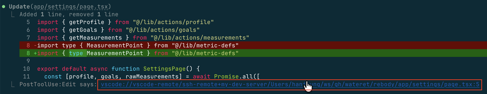
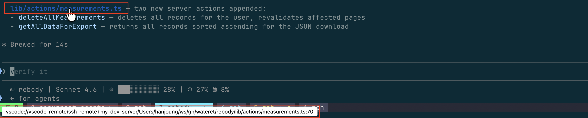

# [Claude Code] VS Code SSH Link — One-Click File Navigation

When Claude Code edits or references files, this setup automatically outputs clickable `vscode://` links in the terminal. It consists of two components, also usable for local env.

## Quick Install

Easiest path: open Claude Code in this repo and ask it to install the setup, pointing it at this README. Example prompts:

**SSH remote:**
> Install https://github.com/wateret/agent-tools/tree/main/misc/vscode-ssh-link . My SSH host is `<HOSTNAME>`.

**Local:**
> Install https://github.com/wateret/agent-tools/tree/main/misc/vscode-ssh-link for local use.

If you'd rather do it by hand, follow the two sections below.

## 1. PostToolUse Hook (Automatic Link on File Tool Use)



Automatically outputs a `vscode://` link after tools that operate on files: `Edit`, `Write`, `NotebookEdit`, `Read`, and `Grep`.

The hook script lives next to this README: [`vscode-ssh-link.sh`](./vscode-ssh-link.sh). Install it as `~/.claude/scripts/vscode-ssh-link.sh`:

```bash
mkdir -p ~/.claude/scripts
cp vscode-ssh-link.sh ~/.claude/scripts/vscode-ssh-link.sh
chmod +x ~/.claude/scripts/vscode-ssh-link.sh
```

> If you have (or want) a clone of this repo and prefer updates to flow automatically, symlink instead of copying:
>
> ```bash
> mkdir -p ~/.claude/scripts
> ln -sf "$(pwd)/vscode-ssh-link.sh" ~/.claude/scripts/vscode-ssh-link.sh
> ```

**Register the hook in `.claude/settings.json`:**

```json
{
  "hooks": {
    "PostToolUse": [
      {
        "matcher": "Edit|Write|NotebookEdit|Grep|Read",
        "hooks": [
          {
            "type": "command",
            "command": "bash ~/.claude/scripts/vscode-ssh-link.sh <HOSTNAME>",
            "timeout": 5
          }
        ]
      }
    ]
  }
}
```

For **local** use, omit the hostname: `bash ~/.claude/scripts/vscode-ssh-link.sh`

## 2. CLAUDE.md Instruction (Links in Text Responses)



The hook only fires on tool use. To make Claude include links when **mentioning** code locations in prose, add a strict rule to your CLAUDE.md. The wording below is intentionally aggressive — softer phrasing ("always include...") is routinely ignored. Even so, compliance is not 100%.

The template below uses the SSH-remote URL form. For **local** use, replace `vscode://vscode-remote/ssh-remote+<HOSTNAME>/` with `vscode://file/` and drop the hostname rule.

````markdown
## Referencing Code Locations

**MANDATORY — NO EXCEPTIONS.** Every mention of an existing file path MUST be rendered as a VS Code remote link. This is not optional, not "when convenient", and not "when the user asks". It applies in prose, code fences, lists, summaries, plans, end-of-turn recaps, questions to the user, and ANY path quoted from tool output (Read/Edit/Write/Glob/Grep), git status, or search results.

**Exception — files you write to disk.** Any `.md` or other file you author or edit (plan files, memory files, scratch notes, docs, READMEs, source files, config, etc.): the rule does NOT apply. Use plain backtick paths. `vscode://` links belong in chat replies only — inside files they just add noise and rot. The rule still applies the moment you quote those paths back to the user in chat.

**Files only — link exactly one concrete file.** Do NOT link directories (use a backtick path, e.g. `~/.claude/tmp/foo/`); the `:line:col` form is meaningless for them. Do NOT link glob/brace/sequence patterns (`src/**/*.ts`, `abcd{1-9}.txt`, `foo[0-9].log`) — they don't resolve to one file. Do NOT link files that don't exist yet (planned/proposed).

**Inline code / code fences — never link.** Paths inside backticks (`` `foo.cpp` ``, `` `foo.cpp:42` ``) or fenced code blocks stay as plain text. Backticks mean "verbatim token" — a `vscode://` link there would render as literal URL text, not a link. The rule applies only to path-shaped tokens in prose.

**Forbidden patterns — these are violations:**
- Bare file path: `src/components/Button.tsx`
- File-path-with-line in prose: `Button.tsx:42`
- Any file mention without the `vscode://...` link
- Wrapping a directory or glob pattern in the `vscode://...` link

**Before sending, scan your response.** Every path-shaped token for an existing file must be a link. If even one is bare, fix it before sending.

Format:

```
[<label>](vscode://vscode-remote/ssh-remote+<HOSTNAME>/<absolute_file_path>:<line>[:<col>])
```

- `<absolute_file_path>` — full path without leading `/`, URL-encoded per segment
- `:<line>` — **always required**. By default, use the earliest relevant line number (e.g. the first line of the function/block being referenced). If no specific line applies, use `1`.
- `:<col>` — optional column number
- `<label>`: relative path or filename or anything user-friendly

Examples:

[src/main.cpp:42](vscode://vscode-remote/ssh-remote+<HOSTNAME>/home/alice/projects/demo/src/main.cpp:42)
[notes/draft #1.md](vscode://vscode-remote/ssh-remote+<HOSTNAME>/home/alice/projects/demo/notes/draft%20%231.md:1)
````

## Why this isn't a plugin

Plugins can't inject rules into `CLAUDE.md`, and the prose-link half of this setup only works as a system-prompt instruction. The hook is also user-specific (SSH hostname) and tiny — wrapping it as a plugin would be overkill. The CLAUDE.md prompt above is a starting point — you may want to tweak it to your taste.

## Prerequisites

- `jq` installed (used for JSON parsing in the hook)
- VS Code with **Remote - SSH** extension installed
- Terminal that supports opening `vscode://` URI scheme (most modern terminals do)
