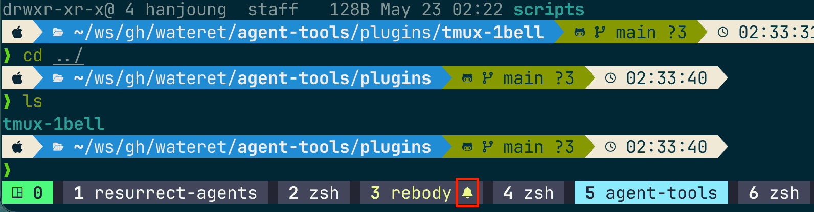

# tmux-1bell

Rings the terminal bell when Claude Code needs your attention — but only when the Claude pane is in a **different tmux window** than the one you're currently looking at. So you get notified when you've context-switched away, and stay quiet when you're already watching.



*The bell indicator in the status bar depends on your `window-status` configuration.*

## What triggers a bell

The bell is triggered via Claude Hooks, and only fires when Claude's pane is in a **different** tmux window than the active one — see [scripts/bell.sh](./scripts/bell.sh) for the detection logic.

## Companion: jump to bell window

Not part of the plugin — an optional standalone script. [scripts/jump-to-bell.sh](./scripts/jump-to-bell.sh) switches to the next window with a pending bell. Copy it somewhere on your path and bind it to a tmux key:

```bash
mkdir -p ~/.config/tmux/scripts && cp jump-to-bell.sh ~/.config/tmux/scripts/ # example path
bind-key b run-shell "~/.config/tmux/scripts/jump-to-bell.sh"  # prefix + b is an example
```

## Prerequisites

- tmux
- A terminal that surfaces the bell (visual flash, audio, or window-urgency hint — your choice via your terminal's bell settings)
